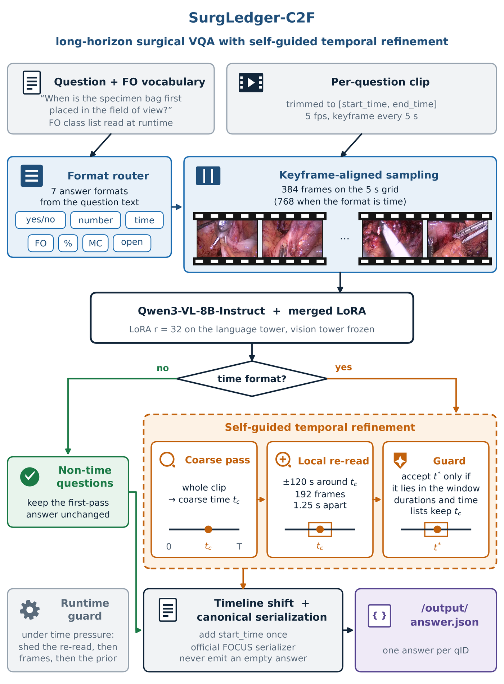
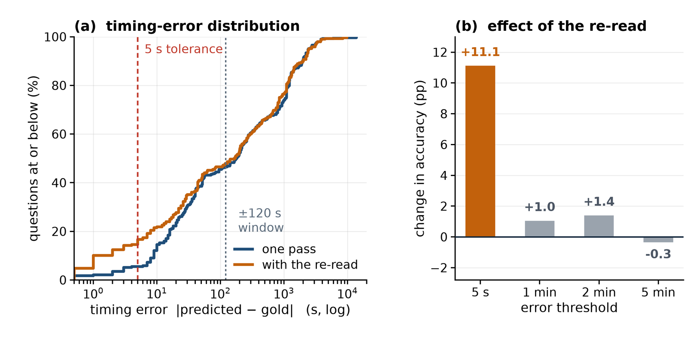

# SurgLedger-C2F: Long-Horizon Surgical VQA with Self-Guided Temporal Refinement

Our submission to the **PROCEDURE track of the ORena FOCUS Challenge (MICCAI 2026)**:
video question answering about foreign objects (sponges, clips, needles, ...) over
full-length laparoscopic procedures that can run for several hours.

The model is Qwen3-VL-8B-Instruct with a LoRA adapter. On top of that, time questions
get a second look: the first answer picks a short window, and the same model is asked
again on dense frames from that window. We call this a self-guided coarse-to-fine
re-read. It needs no extra model and no extra training.

<p align="center">
  
</p>

## How it works

For every question in a batch:

1. **Format routing.** The question text always states the expected answer format
   ("Please answer with yes or no", "in hh:mm:ss", ...), so a keyword router picks
   one of seven formats (`format_router.py`).
2. **Frame sampling.** Clips are 5 fps with a keyframe every 5 s. We only sample
   keyframes, which are several times cheaper to decode than frames in the middle of a
   GOP. 384 frames per question, 768 for time questions (`decode.py`).
3. **First pass.** Qwen3-VL-8B with the merged LoRA answers the question. Frames are
   passed with their real indices and fps, so the per-frame timestamps the model sees
   are correct (`pipeline.py`).
4. **Re-read (time questions only).** The first answer `t_c` defines a +/-120 s window.
   We decode 192 frames inside it (one every 1.25 s) and ask the same model again
   (`inference.py`, `_refine`). Two checks decide whether the new answer is used:
   - if the refined time falls outside the window we just showed, we keep `t_c`;
   - durations and lists of time points are not a single position on the timeline,
     so they always keep `t_c`.
5. **Output.** Every answer goes through `serialize()` so it parses in the official
   format, time answers are shifted by the clip's `start_time`, and a failed question
   gets the format's fallback answer instead of an empty string.

A budget guard keeps the batch inside the platform's time limit
(120 s setup + 30 s per question). When time gets tight it first skips the re-read,
then uses fewer frames, and in the worst case answers with the format prior.

## Results

<p align="center">
  
</p>

Effect of the re-read on time questions from our video-disjoint validation split.
(a) Cumulative distribution of the absolute timing error, one pass vs. with the
re-read. (b) Change in accuracy at different tolerances. The gain is at the 5 s
scoring tolerance (+11.1 pp) while coarser tolerances barely move, so the second
pass sharpens localization inside a neighbourhood the first pass had already found.

## Repository layout

```
inference/                      the submitted container
    inference.py                entry point: batch loop, budget guard, re-read
    resources/surgledger/
        pipeline.py             Qwen3-VL wrapper: prompting, frame handling, answering
        decode.py               keyframe-aligned sampling and time budget helpers
        format_router.py        answer format routing and serialization
        template_priors.py      per-template answer priors (tables left empty, see below)
    resources/adapter/          the LoRA adapter goes here (downloaded separately)
    Dockerfile, requirements.txt
    do_build.sh, do_test_run.sh build the image and run it on the sample batch
    test/input/                 the organizers' small sample batch
    test_clipsource.py          test for the two input layouts (folders vs. zip)
training/                       frame cache, LoRA fine-tuning, loader tests
figures/                        figures from our method description
```

## Running the container

You need Docker with the NVIDIA container toolkit and a GPU with enough memory for an
8B model with long video inputs (we used an L40S and an RTX PRO 6000).

```bash
cd inference
./do_build.sh       # build the image (downloads Qwen3-VL-8B-Instruct, ~17 GB)
./do_test_run.sh    # run on the sample batch in test/input, output in test/output
```

The container reads `/input/request.json`, `/input/FO_definitions.json` and the
clips (either `/input/plain/<qID>.mp4` or `/input/batch-videos.zip`), and writes
`/output/answer.json`. It runs with `--network none`, so everything it needs is baked
into the image.

The pure-Python parts have self-checks:

```bash
cd inference/resources/surgledger
python decode.py && python format_router.py && python template_priors.py && python pipeline.py
```

## Training

Single LoRA adapter on Qwen3-VL-8B-Instruct, trained on the FRAME, SEGMENT and
PROCEDURE training sets of HeiCo-FOCUS-VQA and LapChole-FOCUS-VQA. Rank 32, alpha 64,
dropout 0.05 on the attention and MLP projections of the language model, vision tower
frozen. AdamW (lr 1e-4, betas 0.9/0.95, no weight decay), 3% warm-up then cosine decay,
gradient clipping at 1.0, effective batch size 16 on 4 GPUs, bf16. We warm-started
from an early checkpoint of a PROCEDURE-only run. All train/validation splits are by
whole video, never by question.

A few question templates have an answer that is almost always the same, and the
pipeline emits it directly for those. The values are fitted on the challenge
annotations and are not stored here; `training/fit_template_priors.py` rebuilds them.

The scripts and the exact commands are in [`training/`](training/README.md).

## Model weights

The LoRA adapter from the submitted container is at
[srivatsan6923/surgledger-c2f-lora](https://huggingface.co/srivatsan6923/surgledger-c2f-lora).
Download it into `inference/resources/adapter/` before building the image:

```bash
cd inference/resources/adapter
huggingface-cli download srivatsan6923/surgledger-c2f-lora \
    adapter_config.json adapter_model.safetensors --local-dir .
```

Without the adapter the container still builds and runs, on the base model.

## Data and acknowledgements

- Challenge: https://procedure.orena-focus-challenge.org/
- HeiCo-FOCUS-VQA: https://huggingface.co/datasets/orena-dkfz/heico-focus-vqa
- LapChole-FOCUS-VQA: https://huggingface.co/datasets/orena-dkfz/lapchole-focus-vqa

The frames in Fig. 1 come from a training video of the Heidelberg colorectal data set
(Maier-Hein et al., Scientific Data 8, 101, 2021), licensed CC BY-NC-SA 4.0.

The container setup (`Dockerfile`, `do_*.sh`, sample inputs) is based on the
organizers' submission template.

## License

The code in this repository is Apache-2.0 (see `LICENSE`). The LoRA weights are
released for non-commercial research use, because the data they were trained on is:
HeiCo-FOCUS builds on the Heidelberg colorectal data set (CC BY-NC-SA 4.0), and
LapChole-FOCUS is covered by the challenge's data usage agreement. This is research
code from a challenge submission, not a medical device.

## References

1. Qwen Team. Qwen3 Technical Report. arXiv:2505.09388, 2025.
2. E. J. Hu et al. LoRA: Low-Rank Adaptation of Large Language Models. arXiv:2106.09685, 2021.
3. Hugging Face. PEFT: Parameter-Efficient Fine-Tuning. https://github.com/huggingface/peft
4. L. Maier-Hein et al. Heidelberg colorectal data set for surgical data science in the
   sensor operating room. Scientific Data 8, 101, 2021.

## Citation

```bibtex
@misc{sarvesan2026surgledgerc2f,
  title  = {SurgLedger-C2F: Self-Guided Coarse-to-Fine Temporal Re-Reading for
            Long-Horizon Surgical Video Question Answering},
  author = {Sarvesan, Srivatsan},
  year   = {2026},
  note   = {ORena SAVE FOCUS Challenge (PROCEDURE track), MICCAI 2026},
  url    = {https://github.com/Srivatsan6923/SurgLedger-C2F}
}
```

## Contact

Srivatsan Sarvesan, University of California San Diego (ssarvesan@ucsd.edu)
